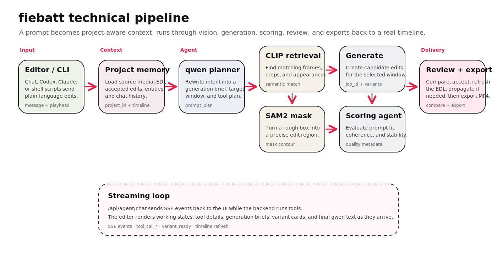

# fiebatt

fiebatt is a prompt-driven video editor for precise, localized edits. It is built for the moment when you do not want to regenerate an entire video, but you do want to change one object, one action, or one short range inside an existing reel.

The product has three surfaces that all talk to the same backend:

- a Next.js web editor for reviewing projects, editing timelines, chatting with the agent, comparing variants, and exporting the final reel
- a FastAPI backend that owns uploads, projects, timelines, jobs, generation, scoring, propagation, and exports
- a CLI/agent workflow so Codex, Claude, or shell scripts can drive the same editing loop from the terminal

## What fiebatt does

1. Upload or reopen a source video.
2. Scrub to the moment you want to change.
3. Select a region if the edit should stay localized.
4. Describe the edit in plain language.
5. fiebatt builds a structured request with the active project, playhead, selected region, timeline state, and conversation history.
6. The backend plans the edit, runs vision/localization, generates candidate variants, scores the results, and streams progress back to the UI.
7. You compare the original and modified output, accept the best variant, and export the final cut.

## Technical flow

The full pipeline is captured as an Excalidraw diagram:



[Open the fiebatt technical flow diagram](apps/web/public/fiebatt-technical-flow.excalidraw)

The diagram covers the end-to-end path from editor or CLI input through project context, qwen planning, CLIP retrieval, SAM2 masking, frame inspection, localized generation, scoring, variant storage, compare, timeline refresh, continuity, and export.

## Why it is different

Most AI video tools treat generation as the whole product. fiebatt treats generation as one step inside an editable timeline system.

Current tools usually make you choose between two extremes:

- traditional editors, where every mask, keyframe, export, and re-import is manual
- prompt-to-video tools, where the output is detached from the original timeline and hard to revise precisely

fiebatt sits between those extremes. A prompt is not just text. It is tied to project state, selected frame range, region geometry, previous messages, accepted edits, generated variants, scores, and the final export pipeline.

## Main features

### Project library

The web app has a project library for reopening existing reels and starting new edits. Projects keep their source media, generated media, saved timeline state, and accepted changes.

### Editor workspace

The editor includes:

- source video preview
- timeline and clip controls
- chat-based edit requests
- region selection
- variant preview and apply flow
- compare mode for original versus modified output
- export controls

### Agent chat

The chat panel sends messages to `/api/agent/chat`. Each message includes the active project and editor context, so the backend knows what the user means by “this moment,” “the subject,” or “the selected region.”

Responses stream back as SSE events. The UI can show working states, tool details, generation briefs, variant previews, and final text as the backend progresses.

### Mesh API model gateway

The agent and text planning path can route through Mesh API, which exposes an
OpenAI-compatible gateway for many models. In that mode fiebatt uses the same
tool-calling loop, but points the OpenAI SDK at Mesh with `MESH_API_KEY`,
`MESH_API_BASE_URL`, and `MESH_MODEL`.

The default Mesh model route is `deepseek/deepseek-v3.2` for text reasoning,
prompt rewriting, and tool selection. Vision-heavy payloads can still use the
existing vision provider unless a multimodal Mesh model is configured.

Mesh can also be selected as a video gateway by setting
`VIDEO_GEN_PROVIDER=meshapi_veo`. That path uses `MESH_VIDEO_MODEL`
(`google/veo-3` by default) and `MESH_VIDEO_ENDPOINT`, so the exact model ID can
be swapped to whatever Veo 3 route is enabled in the Mesh dashboard.

See [`meshapi/`](meshapi/) for the small routing manifest and setup notes.

### Video provider routing

`VIDEO_GEN_PROVIDER=auto` is the default. It routes edits of uploaded footage
to Wan so the model receives the source clip and retains temporal context.
HappyHorse remains available as an explicit source-edit fallback. Google Veo
is available for explicit short image-conditioned generation and accepts only
4, 6, or 8 second requests; first/last-frame and reference-image requests must
be 8 seconds. Set `VEO_MODEL=veo-3.1-fast-generate-preview` for interactive
previews or select the standard Veo model when quality is more important than
latency.

### Vision and localization

The vision path can use:

- qwen vision for subject identification and prompt planning
- CLIP-style retrieval for matching frames, crops, or similar appearances
- SAM2 masks for turning a rough selected box into a more precise region
- frame inspection for confidence, category, attributes, and crop context

This is what lets fiebatt keep edits localized instead of blindly changing the full frame.

### Generation and scoring

Generation jobs produce candidate variants for a target edit window. Results are tracked with status, URLs, descriptions, errors, prompt adherence, and visual coherence scores.

Scoring helps decide which outputs are worth showing and which should be rejected or retried.

### Timeline persistence

The editor stores a real EDL-style timeline. When a variant is accepted, the backend creates a generated segment and the frontend refreshes the timeline. Manual timeline changes are also saved back to the backend.

### Continuity propagation

After a generated edit is accepted, fiebatt can search for matching appearances and prepare continuity edits. This helps a localized change feel authored across the reel rather than isolated to one frame range.

### Export

Export jobs render the current timeline into a final MP4. The backend handles clip rendering, stitching, fps normalization, and final output URLs.

### CLI and agent workflow

The CLI wraps the same backend API that powers the web editor. That means an agent that can run shell commands can inspect a project, preview footage, generate edits, score variants, accept a result, propagate continuity, and export the final video without a custom integration.

## Repository layout

```text
apps/
  web/           Next.js app: landing page, project library, editor UI
  api/           FastAPI app, AI adapters, prompts, workers, and tests
    vision-worker/  Optional SAM2 and CLIP inference service
  cli/           Command-line interface for scripting and agent workflows

docs/
  demo-clips/   Demo source clips
  images/       Documentation images
  internal/     Engineering notes and completed task records
  plans/        Architecture plans
  product/      Product docs
  reference/    API and architecture docs

compose.yaml     Local and self-hosted service orchestration
scripts/         Development, deployment, and smoke-test scripts
storage/         Local development media storage
```

## Local development

### Prerequisites

- Node 20+
- Python 3.11+
- ffmpeg on your PATH
- backend dependencies installed in your Python environment

### Install web dependencies

```bash
cd apps/web
npm install
```

### Run the web app

```bash
cd apps/web
npm run dev
```

The Next.js app runs on port `3001` by default.

### Run the API

From the repository root:

```bash
./scripts/dev_api.sh
```

The backend runs on port `8000` by default.

### Run the full local stack

After installing the frontend, backend, and vision-worker dependencies:

```bash
bash scripts/dev_all.sh
```

This starts the frontend, backend, and vision worker together and writes their
logs to `.dev-logs/`.

## Codex plugin

Fiebatt is distributed as a public Codex marketplace plugin backed by the
hosted Fiebatt service. Users do not need to install the Python CLI or run the
backend locally.

```bash
codex plugin marketplace add ASAC44/fiebatt
codex plugin add fiebatt@fiebatt
```

Start a new Codex thread after installation, then ask to edit a video or invoke
`$fiebatt-edit` explicitly. Codex opens the Fiebatt browser sign-in flow when
authentication is required. Configure personal model-provider credentials only
through the HTTPS Fiebatt settings page; never paste credentials into chat.

To refresh an existing installation:

```bash
codex plugin marketplace upgrade fiebatt
codex plugin add fiebatt@fiebatt
```

To remove it:

```bash
codex plugin remove fiebatt
codex plugin marketplace remove fiebatt
```

### Run with Docker Compose

```bash
docker compose up --build api db
```

If you want the optional vision-worker profile:

```bash
docker compose --profile gpu up --build vision-worker
```

## Environment configuration

Start with:

```bash
cp .env.example .env
```

Important environment groups:

- database: `DATABASE_URL`
- auth: `AUTH_JWT_SECRET`, `AUTH_JWT_EXPIRES_MINUTES`
- media storage: `S3_BUCKET`, `AWS_REGION`, and the standard AWS credential chain, or local media fallback
- AI mode: `USE_AI_STUBS`
- local edit rollout: `ADAPTIVE_EDIT_PLANNING` (defaults off; fixed-window fallback stays available)
- emergency continuity override: `ALLOW_HARD_FAILED_ACCEPTANCE` (keep off during normal rollout)
- Mesh API gateway: `MESH_API_KEY`, `MESH_API_BASE_URL`, `MESH_MODEL`, `MESH_VIDEO_MODEL`, `MESH_VIDEO_ENDPOINT`
- generation provider: `VIDEO_GEN_PROVIDER`, `VEO_MODEL`, `VIDEO_GENERATION_TIMEOUT`

The web app uses first-party email/password auth. Create an account at
`/signup`, then log in at `/login`; the browser stores a JWT and sends it to
the backend as `Authorization: Bearer <token>`.
- vision worker: `VISION_WORKER_URL` (`GPU_WORKER_URL` remains a compatibility fallback)
- provider keys: Mesh API / qwen / Gemini / DashScope / ElevenLabs keys depending on the path being tested

For a Hugging Face ZeroGPU worker, upload `apps/api/vision-worker/hf-space/`
as a Gradio Space, select ZeroGPU hardware, and set `VISION_WORKER_URL` to its
public `https://<owner>-<space>.hf.space` URL. The backend calls the Space's
named `/segment` Gradio endpoint automatically.

For quick local development, `USE_AI_STUBS=true` keeps the pipeline testable without paid providers. For real generation, use `USE_AI_STUBS=false` and configure the required provider keys. If `MESH_API_KEY` is present, the agent chat loop prefers Mesh API for text planning and tool calls.

## Backend API map

Core endpoints:

- `GET /api/health` checks backend liveness
- `GET /api/projects` lists projects
- `POST /api/upload` uploads a source video
- `GET /api/projects/{id}` loads project state
- `GET /api/timeline/{id}` loads timeline state
- `PUT /api/timeline/{id}` saves the editor EDL
- `POST /api/agent/chat` streams agent chat events
- `POST /api/identify` identifies a selected region
- `POST /api/mask` returns a SAM-style mask contour
- `POST /api/generate` starts a generation job
- `GET /api/jobs/{id}` checks generation status
- `GET /api/jobs/{id}/stream` streams job events
- `POST /api/accept` applies a generated variant
- `GET /api/entities/{id}` lists matching appearances
- `POST /api/propagate` starts continuity propagation
- `POST /api/narrate` generates narration audio
- `POST /api/export` starts final export
- `GET /api/export/{id}` checks export status

## AI observability

The backend exposes lightweight AI observability routes:

```bash
curl http://localhost:8000/api/health
curl http://localhost:8000/api/ai/health
curl "http://localhost:8000/api/ai/timeline?last_n=10"
```

There is also an SSE stream:

```js
const events = new EventSource("http://localhost:8000/api/ai/stream");
events.addEventListener("init", (event) => console.log(JSON.parse(event.data)));
events.onmessage = (event) => console.log(JSON.parse(event.data));
```

## Common checks

Web build:

```bash
cd apps/web
npm run build
```

Backend and AI tests:

```bash
PYTHONPATH=apps/api pytest apps/api/tests -q
```

Smoke flow:

```bash
./scripts/smoke.sh
```

## Demo clips

Demo source clips live in:

```text
docs/demo-clips/
```

These are useful for local testing, docs, and repeatable demos.

## Notes for contributors

- Keep the web app in `apps/web`; this is the only supported frontend.
- Prefer backend API changes that preserve the same editor and CLI flow.
- Keep generated media, debug frames, and scratch files out of the repository unless they are intentional documentation assets.
- If you add a new backend capability, update the Excalidraw flow diagram and this README so the product story stays accurate.
